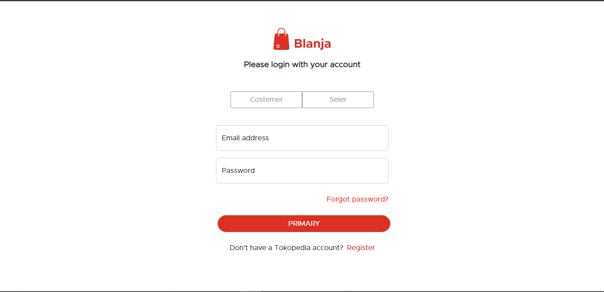
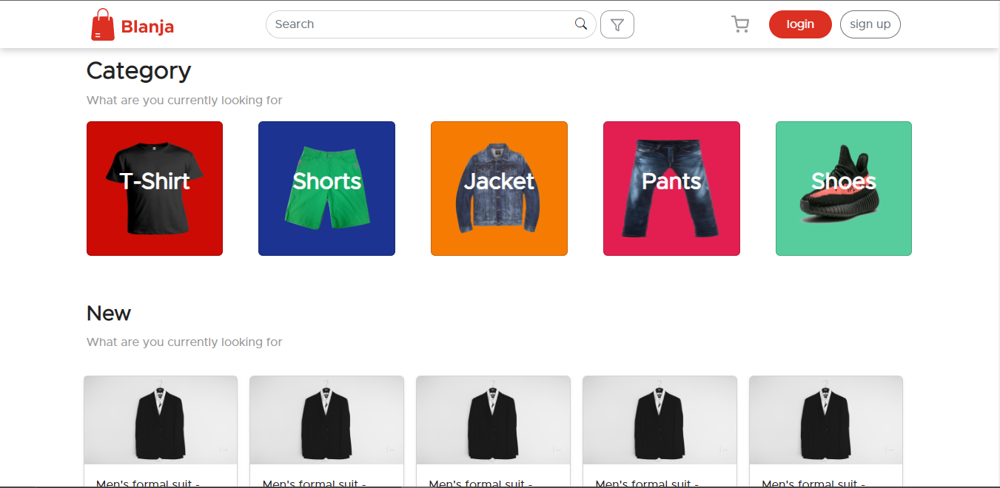
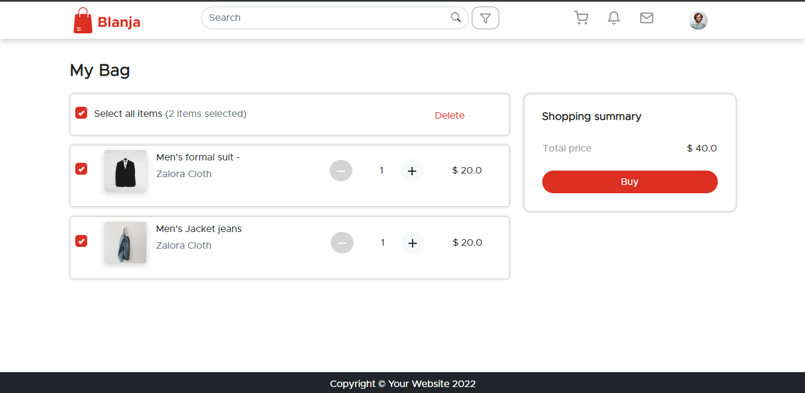
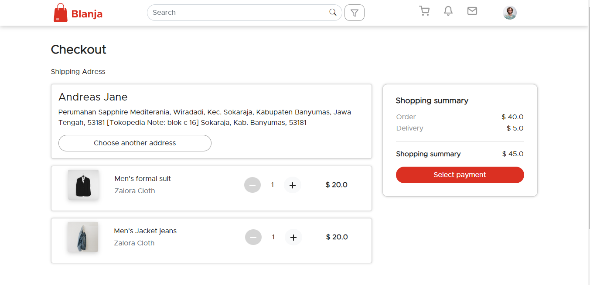

<h1 align="center">Belanja</h1>


<p align="center">
  <a href="https://getbootstrap.com/">
    
  </a>
</p>

<h3 align="center">Bootstrap</h3>

<p align="center">
  Sleek, intuitive, and powerful front-end framework for faster and easier web development.
  <br>
  <a href="https://getbootstrap.com/docs/5.2/"><strong>Explore Bootstrap docs »</strong></a>
  <br>
  <br>
  <a href="https://github.com/twbs/bootstrap/issues/new?assignees=-&labels=bug&template=bug_report.yml">Report bug</a>
  ·
  <a href="https://github.com/twbs/bootstrap/issues/new?assignees=&labels=feature&template=feature_request.yml">Request feature</a>
  ·
  <a href="https://themes.getbootstrap.com/">Themes</a>
  ·
  <a href="https://blog.getbootstrap.com/">Blog</a>
</p>

# Belanja
Belanja is a web-based marketplace application (clothing products). This application allows users to sell their products as well as buy existing products. This Shopping Slicing application was built using a css framework, namely bootstrap


## Prerequiste
* Bootstrap V.5 - Download and Install [Bootstrap](https://getbootstrap.com/docs/5.0/getting-started/introduction/) - Simple bash script to manage multiple active framwork css versions.


## Installation
### Clone
```
$ git clone https://github.com/wahyuwww/slicingBlanja.git
$ cd slicingBlanja
```

### Start Development Server
```
Go live server
```

## Link Netlify
[Belanja](https://master--zingy-seahorse-3eb135.netlify.app/home)

## Screenshots
<div align="center">
     
    
     
    
</div>


